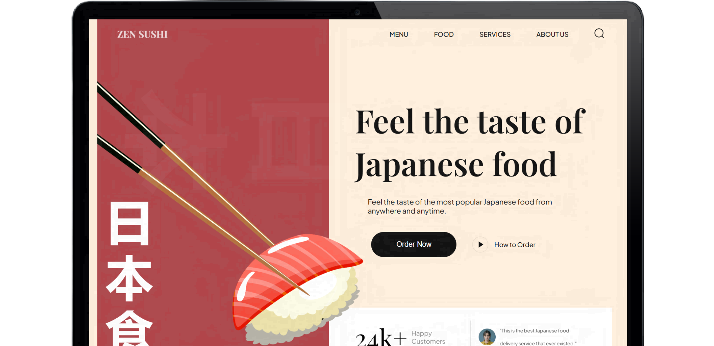

# Zen Sushi Project 🍣🍱🥢




## About 📖
Welcome to the Zen Sushi Project! This is a modern, responsive web application showcasing a sushi restaurant's offerings with a sleek and user-friendly interface.

## Tech Stack 🛠️

- HTML
- CSS
- JavaScript
- Vite (for build and development)

## Features 🌟

🎨 **CSS Variables**: Utilize CSS variables to maintain a consistent and easily adjustable styling approach throughout the project.

📁 **Importing CSS Files**: Import CSS files into others, promoting modularity and organization in styling.

🔧 **Flex and Position Properties**: Use of flex and position properties in CSS to create responsive and well-structured layouts.

💻 **Rendering HTML through JavaScript**: Rendering HTML through JavaScript using reusable functions, enhancing code efficiency.

✨ **Smooth Animations**: Smooth and subtle animations to enhance the overall user experience, focusing on fluid transitions.

🏗️ **BEM Method**: Follow the Block Element Modifier (BEM) methodology for naming classes, promoting a clear and maintainable structure.

📂 **Organized File and Folder Structure**: Maintain a well-organized file and folder structure for easy navigation and management of project assets.

📱 **Responsive Design**: The application is completely responsive across all devices, employing responsive design techniques such as media queries and fluid layouts.

## Getting Started 🚀

To run this project locally:

1. Clone the repository
2. Install dependencies with `npm install`
3. Start the development server with `npm run dev`

## Build 🏗️

To build the project for production:

```
npm run build
```

This will generate a `dist` folder with the built assets.

## Contributing 🤝

Contributions are welcome! Please feel free to submit a Pull Request.

## License 📄

This project is open source and available under the [MIT License](LICENSE).
